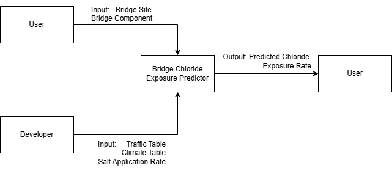

# Summary
The Bridge Chloride Exposure Predictor (BCEP) is a web-based tool designed to forecast future chloride exposure rates for bridges based on a calculation model (reference?) developed by Dr. Mingsai Xu and Dr. Cancan Yang, with an assumption that the climate and traffic data is constant within a specific GRID_SIZE for a JURISDICTION. This model integrates traffic and climate data to predict chloride exposure, specifically focusing on damage from deicing salts while excluding other factors such as mechanical wear or accidents. Currently, this model is validated for Ontario, Canada, and a demonstration website for an accessible overview is available [here](https://bcep.onrender.com/). Expanding the tool's applicability requires domain experts or developers to validate the traffic and climate data and generate chloride exposure rates for additional jurisdictions.

# Statement of need

Most highway bridges are constructed with reinforced concrete decks, which are susceptible to chloride-induced corrosion due to adverse weather conditions and traffic patterns. Various factors contribute to this corrosion, including the quality of construction materials and maintenance practices, with deicing salts being a significant contributor. The primary deicing salt used is sodium chloride (rock salt). When rock salt melts the snow and comes into contact with water, it can undergo a chemical reaction, releasing chloride ions. These ions can penetrate the concrete and cause corrosion in the reinforcing steel, thereby compromising the bridge’s structural integrity and load-bearing capacity. Chloride is considered the main source of corrosion damage to reinforced concrete. Chloride ions are transported from the road to the exterior surface of bridge substructures through vehicle spray and splash mechanisms. There is a tight connection between chloride exposure, weather conditions and traffic flow. Specifically, the amount of deicing salt applied on the road surface greatly depends on the amount of snowfall, and the amount of water and dissolved chloride ions that end up on nearby objects depends on the traffic patterns. 

While existing research explores the relationship between chloride and corrosion, there remains a lack of accessible tools, such as a user-friendly website, to visualize chloride exposure rates effectively. Accurate prediction of chloride exposure rates is essential for effective bridge management, construction planning, and research. Government agencies can use this data to prioritize maintenance and allocate budgets efficiently, focusing on bridges with higher corrosion risks. Bridge engineers can use the information to determine minimum structural requirements and ensure that bridges can endure their intended lifespan, particularly during the precise design phase. Researchers, especially those studying the impacts of climate change on infrastructure, benefit from predictive models to understand and mitigate corrosion damage. This project, conducted in collaboration with Dr. Cancan Yang and Dr. Mingsai Xu from McMaster University, highlights the importance of such tools in addressing the challenges posed by chloride-induced corrosion.

do we include the theory (the formulars used to calculated chloride exposure rate) somewhere?

# Features and usage

A quick start guide is provided in the [README.md](https://github.com/CynthiaLiu0805/BridgeCorrosion/blob/main/README.md) of the repository. 

As outlined in \autoref{fig:io}, there are two sources of input:

- User Input: Information is entered through the website interface on the front end.
- Developer Input: Updates (if any) to the traffic table, climate table, and salt application rate need to be made by editing the code directly.

The following sections provide guidance on modifying and customizing the website to suit other jurisdictions.

## Customization
To adapt the code for jurisdictions beyond Ontario, follow these steps to ensure compatibility and proper results:  

### 1. Adapting Mechanisms  
- The physical mechanisms remain the same, but differences in deicing salt application policies should be considered when customizing for a new jurisdiction.  

### 2. Data Collection and Preparation  
- Collect climate data and traffic data specific to the target jurisdiction.  
- Organize the data into a single Excel file.  
- **Ensure Consistency:**  
   - **Grid Size Matching:** The grid sizes for climate and traffic data must align.  
   - **Row Alignment:** Each row in the sheets should represent the same location. For instance, row 2 across all sheets must correspond to the same longitude and latitude.  

#### 2.1 Climate Data Requirements
- **Data Types**:
  - `htotal`: Total snowfall during winter
  - `t1`: Number of days with snowfall
  - `t2`: Number of days with snow melting

- **Data Format**:  
  Climate data should be structured as shown below, with years as columns:

| Year  | 2006        | 2007        | 2008        | ...         |
|-------|-------------|-------------|-------------|-------------|
|       | 206.2145241 | 220.8943212 | 121.5795313 | ...         |
|       | 211.174729  | 221.0476551 | 137.5310097 | ...         |

#### 2.2 Traffic Data Requirements
- **Data Types**:
  - `AADT/Lane`: Anuual average daily traffic per lane
  - `AADTT/Lane`: Anuual average daily truck traffic per lane

- **Data Format**:  
Traffic data should include coordinates, city, and traffic metrics per lane:

| Longitude   | Latitude     | City     | AADT/Lane | AADTT/Lane |
|-------------|--------------|----------|-----------|------------|
| 274.712677  | 49.45780945  | Algoma   | 559       | 103        |
| 275.9333496 | 47.5466156   | Algoma   | 559       | 103        |
| 276.9502258 | 50.10984039  | Cochrane | 603       | 132        |

### 3. Sheet Naming Conventions
To ensure the tool functions correctly, the Excel file must follow specific naming conventions for each sheet:

- **Climate Data Sheets**:  
  - Each type of climate data (`htotal`, `t1`, `t2`) should be placed in a separate sheet, as shown in the data format above.
  - The sheet names must exactly match the data type, e.g., a sheet for total snowfall should be named `htotal`.

- **Traffic Data Sheet**:  
  - All traffic data (`AADT`, `AADTT`) should be included in a single sheet, as shown in the data format above.
  - The sheet must be named `traffic`.

# Acknowledgements

# References
